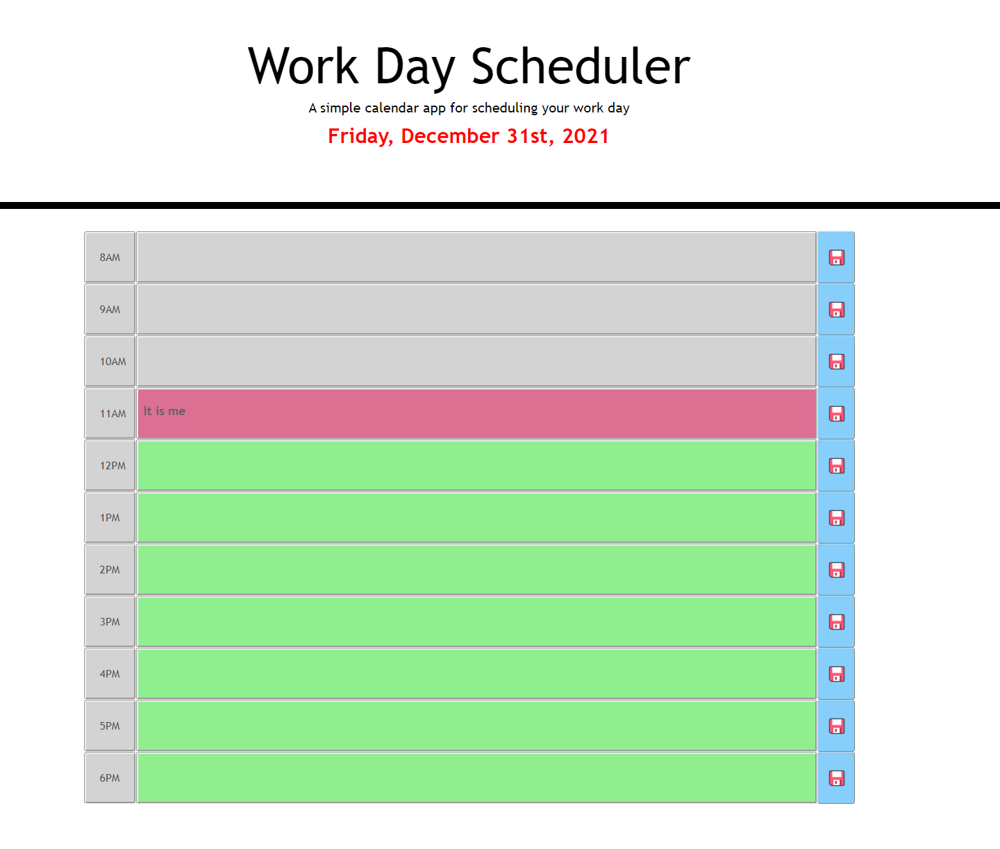

# Workday-Scheduler-Challenge-MM

# Challenge for coding Bootcamp

## Purpose
A website is challange  for bootcamp so it is an assignment
It is the start of a password generator that I will use to showcase my development skills.

Create a simple calendar application that allows the user to save events for each hour of the day. This app will run in the browser and feature dynamically updated HTML and CSS.

## Built With
* HTML
* CSS
* JavaScript
* Bootstrap
* Moments.js

## Website

https://mmcelwee8002.github.io/Workday-Scheduler-Challenge-MM/

## Contribution
Matthew McElwee
12/31/2021

### Screenshots of Portfolio
  "Image #1");

